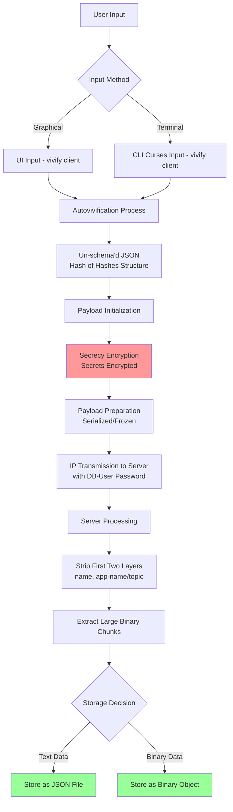
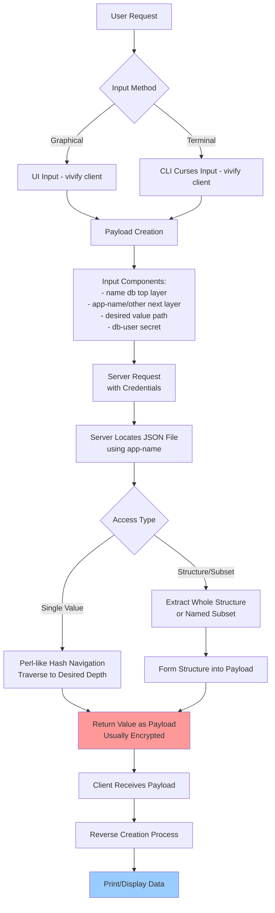
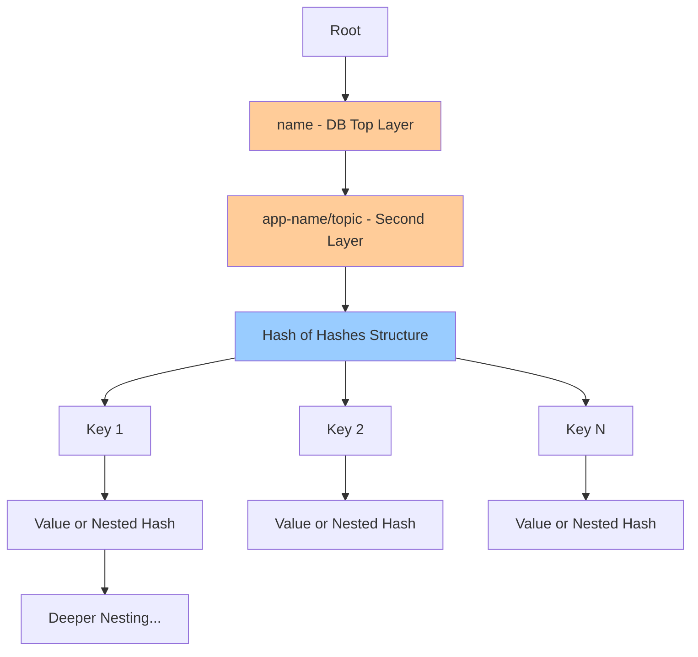
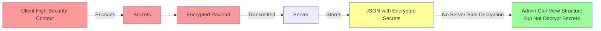

# Payload-Persist Architecture

## Overview

The payload-persist system is designed to function as a standalone secrets keeper with a JSON-based structure for easy recognition and manipulation. This document outlines the initial structure before the Perl Depth.pm app is fully demystified.

**Primary Goal**: Make the payload a JSON structure so the data hierarchy is easily recognizable.

---

## System Operations

### UPDATE or CREATION Flow

#### Key Points

1. **Client-Side Input**: 
   - Graphical (UI) or curses (CLI) input within the vivify client
   - Input is autovivified into un-schema'd JSON (hash of hashes) complex structure

2. **Encryption & Transmission**:
   - Payload is initialized and "secrecy" encrypts secrets
   - Payload is prepared (serialized, frozen) for IP transmission
   - Sent to server with db-user password

3. **Server-Side Processing**:
   - Server strips off first two layers: `name`, `app-name` (or other topic)
   - Large binary chunks are extracted
   - Remainder stored as JSON file or binary object
   - **Not encrypted on server** for admin ease
   - Secrets remain encrypted (client-side encryption in high-security context)
   - Same password can be used for more casual access

---

### RETRIEVAL Flow

#### Key Points

1. **Client-Side Request**:
   - Same UI or CLI curses interface
   - Payload created with:
     - `name` (database top layer)
     - `app-name` or other name (next layer)
     - Desired value path (from hash of hashes JSON)
     - DB-user secret

2. **Server-Side Retrieval**:
   - Access JSON file using `app-name`
   - Navigate using Perl-like hash of hashes syntax
   - Reach desired value at specified depth

3. **Return Options**:
   - **Single Value**: Return specific value (usually encrypted)
   - **Structure/Subset**: Return whole structure or named subset as payload

4. **Client-Side Processing**:
   - Client receives payload
   - Reverses creation process
   - Prints/displays the data

---

## Data Structure Hierarchy

### Layer Breakdown

1. **Layer 1**: `name` - Database top layer (stripped by server)
2. **Layer 2**: `app-name` or topic - Application identifier (stripped by server)
3. **Layer 3+**: Hash of hashes JSON structure (stored on server)
   - Navigable using Perl-like syntax
   - Arbitrary depth supported
   - Values can be encrypted secrets or plain data

---

## Security Model

### Security Characteristics

- **Client-side encryption**: Secrets encrypted in high-security context before transmission
- **Server storage**: JSON stored unencrypted for admin ease
- **Secret protection**: Secrets cannot be decrypted on server (no keys available)
- **Password usage**: Same db-user password for both secure and casual access
- **Separation of concerns**: Structure visible to admins, secrets remain protected

---

## Technology Stack

- **Client**: vivify (UI/CLI with curses)
- **Data Format**: JSON (hash of hashes)
- **Serialization**: Frozen/serialized payloads
- **Navigation**: Perl-like hash of hashes syntax (Depth.pm)
- **Encryption**: Client-side "secrecy" encryption
- **Transport**: IP-based transmission
- **Storage**: JSON files and binary objects

---

## Future Considerations

- Full demystification of Perl Depth.pm app
- Enhanced autovivification capabilities
- Improved structure navigation
- Extended security features
